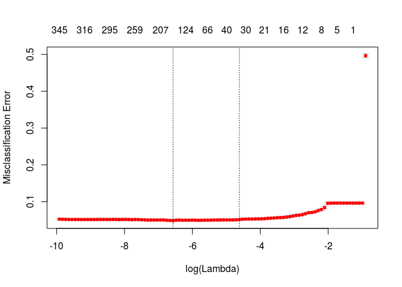
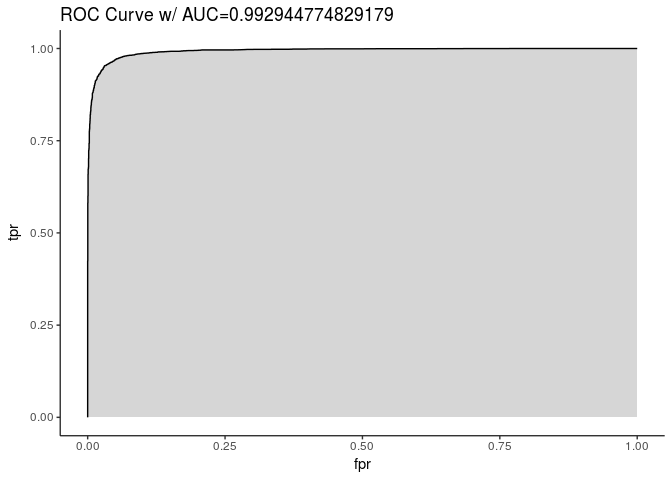

CCES2016: LASSO
================

``` r
# Select Columns of Interest

# Factor Vars
x_fact <- c("inputstate", "gender", "educ", "race2", "immstat",
           "sexuality", "trans", "marstat", "employ", "child18", "religpew",
           "pew_bornagain", "pew_churatd", "union", "faminc", "milstat_1", 
           "milstat_2", "milstat_3", "milstat_4", "milstat_5",
           "investor", "unionhh", "newsint", "healthins_1",  "healthins_2",
           "healthins_3", "healthins_4", "healthins_5", "healthins_6",
           "phone", "internethome", "internetwork", "comptype", "C16_300_1",
           "C16_300_2", "C16_300_3", "C16_300_4", "C16_300_5", "C16_300_6",
           "CC16_300d_1", "CC16_300d_2", "CC16_300d_3", "CC16_300d_4", 
           "CC16_300d_5", "CC16_302", "CC16_303", "CC16_304", "CC16_305_1",
           "CC16_305_2", "CC16_305_1", "CC16_305_2", "CC16_305_3",
           "CC16_305_4", "CC16_305_5", "CC16_305_6", "CC16_305_7", 
           "CC16_305_8", "CC16_305_9", "CC16_305_10", "CC16_305_11",
           "CC16_307", "CC16_321a", "CC16_321b", "CC16_320a", "CC16_320b", 
           "CC16_320c", "CC16_328", "CC16_361", "hadjob",
           "industryclass", "ownhome", "pew_prayer", "pew_religimp",
           "CC16_335", "CC16_337_1", "CC16_337_2", "CC16_337_3", "CC16_351B", 
           "CC16_351E", "CC16_351F", "CC16_351G", "CC16_351H", "CC16_351I", 
           "CC16_351K", "ideo5", "CC16_320a", "CC16_332a",  "CC16_332b",
           "CC16_332c", "CC16_332d", "CC16_332e", "CC16_332f", "CC16_330a",
           "CC16_330b", "CC16_330d", "CC16_330e", "CC16_422c", "CC16_422d",
           "CC16_422e", "CC16_422f", "CC16_331_1", "CC16_331_2", "CC16_331_3",
           "CC16_331_7", "CC16_333a", "CC16_333b", "CC16_333c", "CC16_333d",
           "CC16_425a", "CC16_418a", "edloan", "age_binned", "clinton", 
           "CC16_326")

# Numeric Vars
x_num <- c("age", "score_antiracism", "score_proimmigration", 
           "score_crimereform",  "score_prochoice", "score_enviro", 
           "score_guncontrol")
```

``` r
# Subset to complete values and split 2/3rds of remaining to training set and
# 1/3rd to test set

df2 <- df[!is.na(df$clinton) & !is.na(df$age) &
            !is.na(df$score_antiracism) & !is.na(df$score_crimereform) &
            !is.na(df$score_guncontrol) & !is.na(df$score_enviro) & 
            !is.na(df$score_prochoice) & !is.na(df$score_proimmigration), ]
set.seed(27312)
df2$rand <- sample(c(0,1, 2), nrow(df2), replace = T)
df2$train <- ifelse(df2$rand > 0, 1, 0)

# Create matrix of x vars, enforce factor vars, and reassign missing values.
df_xvars <- df2[, names(df2) %in% x_fact | names(df2) %in% x_num]
df_xvars[is.na(df_xvars)] <- '.'

## Assert factor vars as such
df_xvars[, names(df_xvars) %in% x_fact] <- lapply(df_xvars[, names(df_xvars) %in% x_fact], as.factor)

# Create matrix of y vars and rename column
df_yvar <- as.data.frame(df2[, names(df2) == "clinton"])
df_yvar <- plyr::rename(df_yvar,
                        c("df2[, names(df2) == \"clinton\"]" = "clinton"))

# Create matrix of weights and rename colum
df_weights <- as.data.frame(df2[, names(df2) == "commonweight_vv_post"])
df_weights <- plyr::rename(df_weights,
                           c("df2[, names(df2) == \"commonweight_vv_post\"]" =
                               "weight")
                           )
```

``` r
# Create series of fits for varying lambda values used in 
# cost function for regulatization (N.B. the slowest step in script)
cv_out <- cv.glmnet(x = train_mat2, y = train_y, weights = train_weights,
               family = "binomial", type.measure = "class", alpha = 1,
               nlambda  = 100, parallel = TRUE)

# PLot cv_out (i.e. misclassification errors across lambda values)
plot(cv_out)
```



``` r
# Generate based on optimized cost function
fit_train <- glmnet(x = train_mat2, y = train_y, weights = train_weights,
               family = "binomial", alpha = cv_out$lambda.1se,
               nlambda  = 100)

# Return Beta Values for lasso regression at the regularized lambda value
lamda_chosen <- which(cv_out$lambda == cv_out$lambda.1se)
paste0("The chosen lambda is ", lamda_chosen, ".")
```

    ## [1] "The chosen lambda is 41."

``` r
fit_train$beta[,lamda_chosen]
```

    ##          inputstate2          inputstate4          inputstate5 
    ##         0.0000000000         0.0000000000         0.0000000000 
    ##          inputstate6          inputstate8          inputstate9 
    ##         0.0000000000         0.0000000000         0.0000000000 
    ##         inputstate10         inputstate11         inputstate12 
    ##         0.0000000000         0.0000000000         0.0000000000 
    ##         inputstate13         inputstate15         inputstate16 
    ##         0.0000000000         0.0000000000         0.0000000000 
    ##         inputstate17         inputstate18         inputstate19 
    ##         0.0000000000         0.0000000000         0.0000000000 
    ##         inputstate20         inputstate21         inputstate22 
    ##         0.0000000000         0.0000000000         0.0000000000 
    ##         inputstate23         inputstate24         inputstate25 
    ##         0.0000000000         0.0000000000         0.0000000000 
    ##         inputstate26         inputstate27         inputstate28 
    ##         0.0000000000         0.0000000000         0.0000000000 
    ##         inputstate29         inputstate30         inputstate31 
    ##         0.0000000000         0.0000000000         0.0000000000 
    ##         inputstate32         inputstate33         inputstate34 
    ##         0.0000000000         0.0000000000         0.0000000000 
    ##         inputstate35         inputstate36         inputstate37 
    ##         0.0000000000         0.0000000000         0.0000000000 
    ##         inputstate38         inputstate39         inputstate40 
    ##         0.0000000000         0.0000000000         0.0000000000 
    ##         inputstate41         inputstate42         inputstate44 
    ##         0.0000000000         0.0000000000         0.0000000000 
    ##         inputstate45         inputstate46         inputstate47 
    ##         0.0000000000         0.0000000000         0.0000000000 
    ##         inputstate48         inputstate49         inputstate50 
    ##         0.0000000000         0.0000000000         0.0000000000 
    ##         inputstate51         inputstate53         inputstate54 
    ##         0.0000000000         0.0000000000         0.0000000000 
    ##         inputstate55         inputstate56            comptype2 
    ##         0.0000000000         0.0000000000         0.0000000000 
    ##              gender2                educ2                educ3 
    ##         0.0000000000        -0.0143635573         0.0000000000 
    ##                educ4                educ5                educ6 
    ##         0.0000000000         0.0004655386         0.0031912557 
    ##             marstat1             marstat2             marstat3 
    ##        -0.0142226288         0.0000000000         0.0000000000 
    ##             marstat4             marstat5             marstat6 
    ##         0.0000000000         0.0226053269         0.0000000000 
    ##         CC16_300d_11         CC16_300d_12         CC16_300d_21 
    ##         0.0000000000         0.0000000000         0.0000000000 
    ##         CC16_300d_22         CC16_300d_31         CC16_300d_32 
    ##         0.0000000000         0.0000000000         0.0000000000 
    ##         CC16_300d_41         CC16_300d_42         CC16_300d_51 
    ##         0.0000000000         0.0000000000         0.0000000000 
    ##         CC16_300d_52            CC16_3021            CC16_3022 
    ##         0.0000000000         0.0601275277         0.1211007189 
    ##            CC16_3023            CC16_3024            CC16_3025 
    ##         0.0000000000        -0.0996508795        -0.0989847336 
    ##            CC16_3026            CC16_3031            CC16_3032 
    ##         0.0139979444         0.0344084499         0.0435473956 
    ##            CC16_3033            CC16_3034            CC16_3035 
    ##         0.0000000000        -0.0368920963        -0.0373154190 
    ##            CC16_3041            CC16_3042            CC16_3043 
    ##         0.0070092894         0.0620585533         0.0000000000 
    ##            CC16_3044            CC16_3045            CC16_3046 
    ##        -0.0483115888        -0.0450564370         0.0000000000 
    ##          CC16_305_12          CC16_305_22          CC16_305_32 
    ##         0.0000000000         0.0000000000         0.0000000000 
    ##          CC16_305_42          CC16_305_52          CC16_305_62 
    ##         0.0000000000         0.0000000000         0.0000000000 
    ##          CC16_305_72          CC16_305_82          CC16_305_92 
    ##         0.0000000000         0.0000000000         0.0000000000 
    ##         CC16_305_102         CC16_305_112            CC16_3071 
    ##         0.0000000000        -0.0007444756        -0.0624410355 
    ##            CC16_3072            CC16_3073            CC16_3074 
    ##         0.0301980989         0.0499727953         0.0195897825 
    ##           CC16_321a1           CC16_321a2           CC16_321a3 
    ##         0.0000000000         0.0014295727         0.0000000000 
    ##           CC16_321a4           CC16_321b1           CC16_321b2 
    ##        -0.0063803768         0.0000000000         0.0000000000 
    ##           CC16_321b3           CC16_321b4           CC16_320a1 
    ##         0.0000000000        -0.0048863313         0.1768653868 
    ##           CC16_320a2           CC16_320a3           CC16_320a4 
    ##         0.1393243849        -0.0787172938        -0.2233667103 
    ##           CC16_320a5           CC16_320b1           CC16_320b2 
    ##         0.0000000000         0.0000000000        -0.0008095022 
    ##           CC16_320b3           CC16_320b4           CC16_320b5 
    ##        -0.0125867857         0.0175992734         0.0000000000 
    ##           CC16_320c1           CC16_320c2           CC16_320c3 
    ##         0.0456451645         0.0385660435        -0.0197430909 
    ##           CC16_320c4           CC16_320c5            CC16_3261 
    ##        -0.0495082444         0.0000000000         0.1808128461 
    ##            CC16_3262            CC16_3263            CC16_3264 
    ##        -0.1719724420         0.0000000000         0.0000000000 
    ##            CC16_3265            CC16_3281            CC16_3282 
    ##        -0.0019643937         0.1754797833         0.0729270269 
    ##            CC16_3283            CC16_3284            CC16_3285 
    ##         0.0000000000        -0.1664883100        -0.0739256220 
    ##            CC16_3286            CC16_3287            CC16_3288 
    ##         0.0000000000        -0.0244267669        -0.0567222798 
    ##            CC16_3289           CC16_330a1           CC16_330a2 
    ##         0.0000000000         0.0473295329        -0.0471209712 
    ##           CC16_330b1           CC16_330b2           CC16_330d1 
    ##        -0.0346268420         0.0342499793         0.0883915500 
    ##           CC16_330d2           CC16_330e1           CC16_330e2 
    ##        -0.0893385820        -0.0822007728         0.0814998500 
    ##          CC16_331_12          CC16_331_22          CC16_331_32 
    ##        -0.0753232858         0.0995110248        -0.0721466168 
    ##          CC16_331_72           CC16_332a1           CC16_332a2 
    ##         0.1105122224         0.0742432537        -0.0744636028 
    ##           CC16_332b1           CC16_332b2           CC16_332c1 
    ##        -0.0201533999         0.0203519554        -0.0461496416 
    ##           CC16_332c2           CC16_332d1           CC16_332d2 
    ##         0.0462648181        -0.0792474172         0.0794532976 
    ##           CC16_332e1           CC16_332e2           CC16_332f1 
    ##        -0.0780397253         0.0779008028        -0.0162788128 
    ##           CC16_332f2           CC16_333a1           CC16_333a2 
    ##         0.0152473545         0.0890074057        -0.0888404625 
    ##           CC16_333b1           CC16_333b2           CC16_333c1 
    ##         0.0399200855        -0.0398324455         0.0632502048 
    ##           CC16_333c2           CC16_333d1           CC16_333d2 
    ##        -0.0632683574         0.0900102364        -0.0899320289 
    ##            CC16_3351            CC16_3352          CC16_337_11 
    ##         0.0596420947        -0.0605545701         0.0523141327 
    ##          CC16_337_12          CC16_337_13          CC16_337_21 
    ##         0.0000000000        -0.0425943114        -0.0743310016 
    ##          CC16_337_22          CC16_337_23          CC16_337_31 
    ##         0.0000000000         0.0701517144         0.0184670391 
    ##          CC16_337_32          CC16_337_33           CC16_351B1 
    ##         0.0000000000        -0.0069065041         0.0480985451 
    ##           CC16_351B2           CC16_351E1           CC16_351E2 
    ##        -0.0483385429         0.0000000000         0.0000000000 
    ##           CC16_351F1           CC16_351F2           CC16_351G1 
    ##         0.0105365600        -0.0109209162        -0.0374805258 
    ##           CC16_351G2           CC16_351H1           CC16_351H2 
    ##         0.0379302545         0.0033141737        -0.0033077400 
    ##           CC16_351I1           CC16_351I2           CC16_351K1 
    ##        -0.1620789769         0.1621819158         0.0926752719 
    ##           CC16_351K2            CC16_3611            CC16_3612 
    ##        -0.0927419039         0.0000000000         0.0000000000 
    ##            CC16_3613            CC16_3614            CC16_3615 
    ##         0.0000000000         0.0000000000         0.0000000000 
    ##            CC16_3616              employ2              employ3 
    ##         0.0000000000         0.0000000000         0.0000000000 
    ##              employ4              employ5              employ6 
    ##         0.0000000000         0.0000000000         0.0000000000 
    ##              employ7              employ8              employ9 
    ##         0.0000000000         0.0000000000         0.0000000000 
    ##              hadjob1              hadjob2       industryclass1 
    ##         0.0000000000         0.0000000000         0.0000000000 
    ##      industryclass10      industryclass11      industryclass12 
    ##         0.0000000000         0.0000000000         0.0000000000 
    ##      industryclass13      industryclass14      industryclass15 
    ##         0.0000000000         0.0000000000         0.0000000000 
    ##      industryclass16      industryclass17      industryclass18 
    ##         0.0000000000         0.0000000000         0.0000000000 
    ##      industryclass19       industryclass2      industryclass20 
    ##         0.0000000000         0.0000000000         0.0000000000 
    ##      industryclass21      industryclass22      industryclass23 
    ##         0.0000000000         0.0000000000         0.0000000000 
    ##       industryclass3       industryclass4       industryclass5 
    ##         0.0000000000         0.0000000000         0.0000000000 
    ##       industryclass6       industryclass7       industryclass8 
    ##         0.0000000000         0.0000000000         0.0000000000 
    ##       industryclass9             ownhome1             ownhome2 
    ##         0.0000000000        -0.0262216130         0.0259102155 
    ##             ownhome3             child181             child182 
    ##         0.0000000000         0.0000000000         0.0000000000 
    ##             immstat1             immstat2             immstat3 
    ##         0.0001188833         0.0000000000         0.0000000000 
    ##             immstat4             immstat5       pew_bornagain1 
    ##         0.0000000000         0.0000000000        -0.0271265678 
    ##       pew_bornagain2        pew_religimp1        pew_religimp2 
    ##         0.0273180856        -0.0119094243         0.0000000000 
    ##        pew_religimp3        pew_religimp4         pew_churatd1 
    ##         0.0000000000         0.0286685561        -0.0005887532 
    ##         pew_churatd2         pew_churatd3         pew_churatd4 
    ##         0.0000000000         0.0000000000         0.0000000000 
    ##         pew_churatd5         pew_churatd6         pew_churatd7 
    ##         0.0000000000         0.0104578087         0.0043820782 
    ##          pew_prayer1          pew_prayer2          pew_prayer3 
    ##        -0.0078633981         0.0000000000         0.0000000000 
    ##          pew_prayer4          pew_prayer5          pew_prayer6 
    ##         0.0000000000         0.0000000000         0.0000000000 
    ##          pew_prayer7          pew_prayer8            religpew1 
    ##         0.0225083799         0.0000000000        -0.0266698137 
    ##           religpew10           religpew11           religpew12 
    ##         0.0171919809         0.0000000000         0.0000000000 
    ##            religpew2            religpew3            religpew4 
    ##         0.0000000000         0.0000000000         0.0000000000 
    ##            religpew5            religpew6            religpew7 
    ##         0.0000000000         0.0000000000         0.0000000000 
    ##            religpew8            religpew9               ideo51 
    ##         0.0000000000         0.0170983922         0.0601293677 
    ##               ideo52               ideo53               ideo54 
    ##         0.1025491826         0.0226132901        -0.1151410564 
    ##               ideo55               ideo56           milstat_12 
    ##        -0.0542284644         0.0000000000         0.0000000000 
    ##           milstat_22           milstat_32           milstat_42 
    ##         0.0000000000         0.0093208425         0.0074362191 
    ##           milstat_52               union1               union2 
    ##        -0.0194734159         0.0000000000         0.0000000000 
    ##               union3             unionhh1             unionhh2 
    ##         0.0000000000         0.0000000000         0.0000000000 
    ##             unionhh3             newsint1             newsint2 
    ##         0.0000000000         0.0000000000         0.0000000000 
    ##             newsint3             newsint4             newsint7 
    ##         0.0000000000         0.0000000000         0.0947825289 
    ##              faminc1             faminc10             faminc11 
    ##         0.0000000000         0.0000000000         0.0000000000 
    ##             faminc12             faminc13             faminc14 
    ##         0.0000000000         0.0000000000         0.0000000000 
    ##             faminc15             faminc16              faminc2 
    ##         0.0000000000         0.0000000000         0.0000000000 
    ##              faminc3             faminc31              faminc4 
    ##         0.0000000000         0.0000000000         0.0000000000 
    ##              faminc5              faminc6              faminc7 
    ##         0.0000000000         0.0000000000         0.0000000000 
    ##              faminc8              faminc9             faminc97 
    ##         0.0000000000         0.0000000000         0.0000000000 
    ##            investor1            investor2           sexuality1 
    ##         0.0000000000         0.0000000000        -0.0256320591 
    ##           sexuality2           sexuality3           sexuality4 
    ##         0.0000000000         0.0178437456         0.0000000000 
    ##           sexuality5           sexuality6               trans1 
    ##         0.0000000000         0.0000000000         0.0000000000 
    ##               trans2               trans3         healthins_12 
    ##         0.0000000000         0.0000000000         0.0000000000 
    ##         healthins_22         healthins_32         healthins_42 
    ##         0.0000000000         0.0000000000         0.0000000000 
    ##         healthins_52         healthins_62               phone1 
    ##         0.0000000000         0.0000000000         0.0000000000 
    ##               phone2               phone3               phone4 
    ##         0.0000000000         0.0000000000         0.0000000000 
    ##        internethome1        internethome2        internethome3 
    ##         0.0000000000         0.0000000000         0.0000000000 
    ##        internetwork1        internetwork2        internetwork3 
    ##         0.0000000000         0.0000000000         0.0000000000 
    ##           CC16_425a1           CC16_425a2           CC16_418a1 
    ##         0.0021620950        -0.0025796367         0.0000000000 
    ##           CC16_418a2           CC16_422c1           CC16_422c2 
    ##         0.0000000000         0.0695438174        -0.0131228876 
    ##           CC16_422c3           CC16_422c4           CC16_422c5 
    ##        -0.0639100025        -0.0089860849        -0.0164171794 
    ##           CC16_422d1           CC16_422d2           CC16_422d3 
    ##         0.1298604432         0.0422228055        -0.0321971384 
    ##           CC16_422d4           CC16_422d5           CC16_422e1 
    ##        -0.0845598254        -0.1055618247         0.0000000000 
    ##           CC16_422e2           CC16_422e3           CC16_422e4 
    ##         0.0000000000         0.0000000000         0.0000000000 
    ##           CC16_422e5           CC16_422f1           CC16_422f2 
    ##         0.0000000000        -0.0172586432        -0.0530489580 
    ##           CC16_422f3           CC16_422f4           CC16_422f5 
    ##        -0.0232632461         0.0000000000         0.0710451142 
    ##              edloan1              edloan2           race2black 
    ##         0.0151471238        -0.0150786028         0.1339393992 
    ##          race2latino  race2middle_eastern           race2mixed 
    ##         0.0384932541         0.0000000000         0.0000000000 
    ## race2native_american           race2other           race2white 
    ##         0.0000000000         0.0000000000        -0.1059090754 
    ##                  age      age_binned18-29      age_binned30-39 
    ##        -0.0002536408         0.0000000000         0.0000000000 
    ##      age_binned40-49      age_binned50-64         age_binned65 
    ##         0.0000000000         0.0000000000         0.0000000000 
    ##     score_antiracism     score_guncontrol      score_prochoice 
    ##         0.0911235725         0.0642506307         0.0624146533 
    ## score_proimmigration         score_enviro    score_crimereform 
    ##         0.0865119434         0.0768980359         0.0664405186

``` r
# Generate predicted values for test matrix
fit_test <- predict(fit_train, type="coefficients", weights = test_weights,
                    s=cv_out$lambda.1se, newx=test_mat2) 
```



    ## [1] "Print Weighted Accuracy"

    ## [1] 0.956
