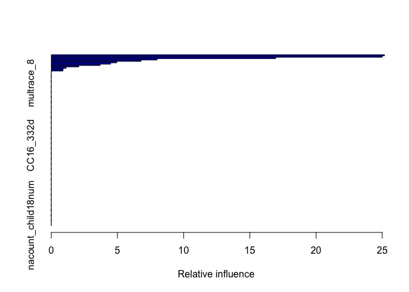

2016 CCESS: Dem Primary
================
Zach Crowell
01/01/2019

``` r
df <- data.table::fread('gunzip -c ~/Downloads/CCES16_Common_OUTPUT_Feb2018_VV.txt.gz', data.table = F)
# Data Source (2018-02-10): https://dataverse.harvard.edu/dataset.xhtml?persistentId=doi%3A10.7910/DVN/GDF6Z0
```

    ## [1] "voted for Sanders (1) or Clinton(0)"

    ## 
    ##    0    1 <NA> 
    ## 5747 4943    0

    ## [1] "Feature Prep Excluded from HTML"

GBM
===

``` r
# Primarily using defulats, 1 cv (as it drops more marginal features),
# and commonweight_vv base on previous runs
set.seed(643)
 gbm1 <- caret::train(xvars, yvar, distribution="bernoulli", method="gbm",
                      weights = df1$commonweight_vv,
                      trControl = trainControl(method = 'cv',  number = 1,
                                               returnResamp ='none',
                                               summaryFunction = twoClassSummary,
                                               classProbs = TRUE),
                      metric = 'ROC',
                      preProc = c("center", "scale")
                      )
```

    ## Warning in `[<-.data.frame`(`*tmp*`, , method$center, value =
    ## structure(list(: provided 14884 variables to replace 122 variables

    ## Warning in preProcess.default(thresh = 0.95, k = 5, freqCut = 19, uniqueCut
    ## = 10, : Std. deviations could not be computed for: gender, educ, marstat,
    ## multrace_1, multrace_2, multrace_3, multrace_4, multrace_5, multrace_8,
    ## CC16_300_1, CC16_300_2, CC16_300_3, CC16_300_4, CC16_300_5, CC16_300_6,
    ## CC16_302, CC16_303, CC16_304, CC16_305_1, CC16_305_2, CC16_305_3,
    ## CC16_305_4, CC16_305_5, CC16_305_6, CC16_305_7, CC16_305_8, CC16_305_9,
    ## CC16_305_10, CC16_305_11, CC16_307, CC16_321a, CC16_321b, CC16_321c,
    ## CC16_321d, CC16_322a, CC16_322b, CC16_322c, CC16_322d, CC16_320a,
    ## CC16_320b, CC16_320c, CC16_320d, CC16_320e, CC16_316, CC16_326, CC16_330a,
    ## CC16_330b, CC16_330d, CC16_330e, CC16_331_1, CC16_331_2, CC16_331_3,
    ## CC16_331_7, CC16_331_9, CC16_332a, CC16_332b, CC16_332c, CC16_332d,
    ## CC16_332e, CC16_332f, CC16_333a, CC16_333b, CC16_333c, CC16_333d,
    ## CC16_334a, CC16_334b, CC16_334c, CC16_334d, CC16_335, CC16_337_1,
    ## CC16_337_2, CC16_337_3, CC16_340a, CC16_340b, CC16_340c, CC16_340d,
    ## CC16_351B, CC16_351E, CC16_351F, CC16_351G, CC16_351H, CC16_351I,
    ## CC16_351K, CC16_360, employ, ownhome, child18, child18num, pid7, immstat,
    ## pew_bornagain, pew_religimp, pew_churatd, pew_prayer, religpew, ideo5,
    ## milstat_1, milstat_2, milstat_3, milstat_4, milstat_5, union, unionhh,
    ## newsint, faminc, investor, sexuality, trans, healthins_1, healthins_2,
    ## healthins_3, healthins_4, healthins_5, healthins_6, internethome,
    ## internetwork, age, score_guncontrol, score_prochoice, score_proimmigration,
    ## score_enviro, nacount_child18num

    ## Warning in `[<-.data.frame`(`*tmp*`, , method$scale, value =
    ## structure(list(: provided 14884 variables to replace 122 variables

    ## Warning in `[<-.data.frame`(`*tmp*`, , object$method$center, value =
    ## structure(list(: provided 14884 variables to replace 122 variables

    ## Warning in `[<-.data.frame`(`*tmp*`, , object$method$scale, value =
    ## structure(list(: provided 14884 variables to replace 122 variables

    ## Warning: model fit failed for Fold1: shrinkage=0.1, interaction.depth=1, n.minobsinnode=10, n.trees=150 Error in (function (x, y, offset = NULL, misc = NULL, distribution = "bernoulli",  : 
    ##   The data set is too small or the subsampling rate is too large: `nTrain * bag.fraction <= n.minobsinnode`

    ## Warning in `[<-.data.frame`(`*tmp*`, , method$center, value =
    ## structure(list(: provided 14884 variables to replace 122 variables

    ## Warning in preProcess.default(thresh = 0.95, k = 5, freqCut = 19, uniqueCut
    ## = 10, : Std. deviations could not be computed for: gender, educ, marstat,
    ## multrace_1, multrace_2, multrace_3, multrace_4, multrace_5, multrace_8,
    ## CC16_300_1, CC16_300_2, CC16_300_3, CC16_300_4, CC16_300_5, CC16_300_6,
    ## CC16_302, CC16_303, CC16_304, CC16_305_1, CC16_305_2, CC16_305_3,
    ## CC16_305_4, CC16_305_5, CC16_305_6, CC16_305_7, CC16_305_8, CC16_305_9,
    ## CC16_305_10, CC16_305_11, CC16_307, CC16_321a, CC16_321b, CC16_321c,
    ## CC16_321d, CC16_322a, CC16_322b, CC16_322c, CC16_322d, CC16_320a,
    ## CC16_320b, CC16_320c, CC16_320d, CC16_320e, CC16_316, CC16_326, CC16_330a,
    ## CC16_330b, CC16_330d, CC16_330e, CC16_331_1, CC16_331_2, CC16_331_3,
    ## CC16_331_7, CC16_331_9, CC16_332a, CC16_332b, CC16_332c, CC16_332d,
    ## CC16_332e, CC16_332f, CC16_333a, CC16_333b, CC16_333c, CC16_333d,
    ## CC16_334a, CC16_334b, CC16_334c, CC16_334d, CC16_335, CC16_337_1,
    ## CC16_337_2, CC16_337_3, CC16_340a, CC16_340b, CC16_340c, CC16_340d,
    ## CC16_351B, CC16_351E, CC16_351F, CC16_351G, CC16_351H, CC16_351I,
    ## CC16_351K, CC16_360, employ, ownhome, child18, child18num, pid7, immstat,
    ## pew_bornagain, pew_religimp, pew_churatd, pew_prayer, religpew, ideo5,
    ## milstat_1, milstat_2, milstat_3, milstat_4, milstat_5, union, unionhh,
    ## newsint, faminc, investor, sexuality, trans, healthins_1, healthins_2,
    ## healthins_3, healthins_4, healthins_5, healthins_6, internethome,
    ## internetwork, age, score_guncontrol, score_prochoice, score_proimmigration,
    ## score_enviro, nacount_child18num

    ## Warning in `[<-.data.frame`(`*tmp*`, , method$scale, value =
    ## structure(list(: provided 14884 variables to replace 122 variables

    ## Warning in `[<-.data.frame`(`*tmp*`, , object$method$center, value =
    ## structure(list(: provided 14884 variables to replace 122 variables

    ## Warning in `[<-.data.frame`(`*tmp*`, , object$method$scale, value =
    ## structure(list(: provided 14884 variables to replace 122 variables

    ## Warning: model fit failed for Fold1: shrinkage=0.1, interaction.depth=2, n.minobsinnode=10, n.trees=150 Error in (function (x, y, offset = NULL, misc = NULL, distribution = "bernoulli",  : 
    ##   The data set is too small or the subsampling rate is too large: `nTrain * bag.fraction <= n.minobsinnode`

    ## Warning in `[<-.data.frame`(`*tmp*`, , method$center, value =
    ## structure(list(: provided 14884 variables to replace 122 variables

    ## Warning in preProcess.default(thresh = 0.95, k = 5, freqCut = 19, uniqueCut
    ## = 10, : Std. deviations could not be computed for: gender, educ, marstat,
    ## multrace_1, multrace_2, multrace_3, multrace_4, multrace_5, multrace_8,
    ## CC16_300_1, CC16_300_2, CC16_300_3, CC16_300_4, CC16_300_5, CC16_300_6,
    ## CC16_302, CC16_303, CC16_304, CC16_305_1, CC16_305_2, CC16_305_3,
    ## CC16_305_4, CC16_305_5, CC16_305_6, CC16_305_7, CC16_305_8, CC16_305_9,
    ## CC16_305_10, CC16_305_11, CC16_307, CC16_321a, CC16_321b, CC16_321c,
    ## CC16_321d, CC16_322a, CC16_322b, CC16_322c, CC16_322d, CC16_320a,
    ## CC16_320b, CC16_320c, CC16_320d, CC16_320e, CC16_316, CC16_326, CC16_330a,
    ## CC16_330b, CC16_330d, CC16_330e, CC16_331_1, CC16_331_2, CC16_331_3,
    ## CC16_331_7, CC16_331_9, CC16_332a, CC16_332b, CC16_332c, CC16_332d,
    ## CC16_332e, CC16_332f, CC16_333a, CC16_333b, CC16_333c, CC16_333d,
    ## CC16_334a, CC16_334b, CC16_334c, CC16_334d, CC16_335, CC16_337_1,
    ## CC16_337_2, CC16_337_3, CC16_340a, CC16_340b, CC16_340c, CC16_340d,
    ## CC16_351B, CC16_351E, CC16_351F, CC16_351G, CC16_351H, CC16_351I,
    ## CC16_351K, CC16_360, employ, ownhome, child18, child18num, pid7, immstat,
    ## pew_bornagain, pew_religimp, pew_churatd, pew_prayer, religpew, ideo5,
    ## milstat_1, milstat_2, milstat_3, milstat_4, milstat_5, union, unionhh,
    ## newsint, faminc, investor, sexuality, trans, healthins_1, healthins_2,
    ## healthins_3, healthins_4, healthins_5, healthins_6, internethome,
    ## internetwork, age, score_guncontrol, score_prochoice, score_proimmigration,
    ## score_enviro, nacount_child18num

    ## Warning in `[<-.data.frame`(`*tmp*`, , method$scale, value =
    ## structure(list(: provided 14884 variables to replace 122 variables

    ## Warning in `[<-.data.frame`(`*tmp*`, , object$method$center, value =
    ## structure(list(: provided 14884 variables to replace 122 variables

    ## Warning in `[<-.data.frame`(`*tmp*`, , object$method$scale, value =
    ## structure(list(: provided 14884 variables to replace 122 variables

    ## Warning: model fit failed for Fold1: shrinkage=0.1, interaction.depth=3, n.minobsinnode=10, n.trees=150 Error in (function (x, y, offset = NULL, misc = NULL, distribution = "bernoulli",  : 
    ##   The data set is too small or the subsampling rate is too large: `nTrain * bag.fraction <= n.minobsinnode`

    ## Warning in nominalTrainWorkflow(x = x, y = y, wts = weights, info =
    ## trainInfo, : There were missing values in resampled performance measures.

    ## Iter   TrainDeviance   ValidDeviance   StepSize   Improve
    ##      1        1.3576             nan     0.1000    0.0078
    ##      2        1.3461             nan     0.1000    0.0055
    ##      3        1.3335             nan     0.1000    0.0063
    ##      4        1.3212             nan     0.1000    0.0056
    ##      5        1.3102             nan     0.1000    0.0052
    ##      6        1.3010             nan     0.1000    0.0045
    ##      7        1.2904             nan     0.1000    0.0048
    ##      8        1.2823             nan     0.1000    0.0039
    ##      9        1.2740             nan     0.1000    0.0045
    ##     10        1.2668             nan     0.1000    0.0035
    ##     20        1.2078             nan     0.1000    0.0018
    ##     40        1.1392             nan     0.1000    0.0011
    ##     50        1.1163             nan     0.1000    0.0010

``` r
# genearte summary stats
predx <- predict(object=gbm1, df2, type='raw', weight = df1$commonweight_vv)
#auc <- roc(ifelse(yvar=="X1",1,0), ifelse(predx=="X1",1,0))
wroc <- WeightedROC(ifelse(predx=="X1",1,0), ifelse(yvar=="X1",1,0), df1$commonweight_vv)
wauc <- WeightedAUC(wroc)

# Summarize
## Rel Influence
summary(gbm1)
```



    ##                                       var    rel.inf
    ## age                                   age 25.1671542
    ## pid7                                 pid7 24.9941139
    ## CC16_351B                       CC16_351B 16.9460882
    ## CC16_320a                       CC16_320a  7.9955065
    ## religpew                         religpew  6.7867098
    ## CC16_304                         CC16_304  4.9440523
    ## CC16_326                         CC16_326  4.4887933
    ## race2                               race2  3.6883435
    ## CC16_337_1                     CC16_337_1  2.0806587
    ## CC16_300_5                     CC16_300_5  1.1225493
    ## ideo5                               ideo5  0.9068010
    ## CC16_334c                       CC16_334c  0.8792294
    ## gender                             gender  0.0000000
    ## educ                                 educ  0.0000000
    ## marstat                           marstat  0.0000000
    ## multrace_1                     multrace_1  0.0000000
    ## multrace_2                     multrace_2  0.0000000
    ## multrace_3                     multrace_3  0.0000000
    ## multrace_4                     multrace_4  0.0000000
    ## multrace_5                     multrace_5  0.0000000
    ## multrace_8                     multrace_8  0.0000000
    ## CC16_300_1                     CC16_300_1  0.0000000
    ## CC16_300_2                     CC16_300_2  0.0000000
    ## CC16_300_3                     CC16_300_3  0.0000000
    ## CC16_300_4                     CC16_300_4  0.0000000
    ## CC16_300_6                     CC16_300_6  0.0000000
    ## CC16_302                         CC16_302  0.0000000
    ## CC16_303                         CC16_303  0.0000000
    ## CC16_305_1                     CC16_305_1  0.0000000
    ## CC16_305_2                     CC16_305_2  0.0000000
    ## CC16_305_3                     CC16_305_3  0.0000000
    ## CC16_305_4                     CC16_305_4  0.0000000
    ## CC16_305_5                     CC16_305_5  0.0000000
    ## CC16_305_6                     CC16_305_6  0.0000000
    ## CC16_305_7                     CC16_305_7  0.0000000
    ## CC16_305_8                     CC16_305_8  0.0000000
    ## CC16_305_9                     CC16_305_9  0.0000000
    ## CC16_305_10                   CC16_305_10  0.0000000
    ## CC16_305_11                   CC16_305_11  0.0000000
    ## CC16_307                         CC16_307  0.0000000
    ## CC16_321a                       CC16_321a  0.0000000
    ## CC16_321b                       CC16_321b  0.0000000
    ## CC16_321c                       CC16_321c  0.0000000
    ## CC16_321d                       CC16_321d  0.0000000
    ## CC16_322a                       CC16_322a  0.0000000
    ## CC16_322b                       CC16_322b  0.0000000
    ## CC16_322c                       CC16_322c  0.0000000
    ## CC16_322d                       CC16_322d  0.0000000
    ## CC16_320b                       CC16_320b  0.0000000
    ## CC16_320c                       CC16_320c  0.0000000
    ## CC16_320d                       CC16_320d  0.0000000
    ## CC16_320e                       CC16_320e  0.0000000
    ## CC16_316                         CC16_316  0.0000000
    ## CC16_330a                       CC16_330a  0.0000000
    ## CC16_330b                       CC16_330b  0.0000000
    ## CC16_330d                       CC16_330d  0.0000000
    ## CC16_330e                       CC16_330e  0.0000000
    ## CC16_331_1                     CC16_331_1  0.0000000
    ## CC16_331_2                     CC16_331_2  0.0000000
    ## CC16_331_3                     CC16_331_3  0.0000000
    ## CC16_331_7                     CC16_331_7  0.0000000
    ## CC16_331_9                     CC16_331_9  0.0000000
    ## CC16_332a                       CC16_332a  0.0000000
    ## CC16_332b                       CC16_332b  0.0000000
    ## CC16_332c                       CC16_332c  0.0000000
    ## CC16_332d                       CC16_332d  0.0000000
    ## CC16_332e                       CC16_332e  0.0000000
    ## CC16_332f                       CC16_332f  0.0000000
    ## CC16_333a                       CC16_333a  0.0000000
    ## CC16_333b                       CC16_333b  0.0000000
    ## CC16_333c                       CC16_333c  0.0000000
    ## CC16_333d                       CC16_333d  0.0000000
    ## CC16_334a                       CC16_334a  0.0000000
    ## CC16_334b                       CC16_334b  0.0000000
    ## CC16_334d                       CC16_334d  0.0000000
    ## CC16_335                         CC16_335  0.0000000
    ## CC16_337_2                     CC16_337_2  0.0000000
    ## CC16_337_3                     CC16_337_3  0.0000000
    ## CC16_340a                       CC16_340a  0.0000000
    ## CC16_340b                       CC16_340b  0.0000000
    ## CC16_340c                       CC16_340c  0.0000000
    ## CC16_340d                       CC16_340d  0.0000000
    ## CC16_351E                       CC16_351E  0.0000000
    ## CC16_351F                       CC16_351F  0.0000000
    ## CC16_351G                       CC16_351G  0.0000000
    ## CC16_351H                       CC16_351H  0.0000000
    ## CC16_351I                       CC16_351I  0.0000000
    ## CC16_351K                       CC16_351K  0.0000000
    ## CC16_360                         CC16_360  0.0000000
    ## employ                             employ  0.0000000
    ## ownhome                           ownhome  0.0000000
    ## child18                           child18  0.0000000
    ## child18num                     child18num  0.0000000
    ## immstat                           immstat  0.0000000
    ## pew_bornagain               pew_bornagain  0.0000000
    ## pew_religimp                 pew_religimp  0.0000000
    ## pew_churatd                   pew_churatd  0.0000000
    ## pew_prayer                     pew_prayer  0.0000000
    ## milstat_1                       milstat_1  0.0000000
    ## milstat_2                       milstat_2  0.0000000
    ## milstat_3                       milstat_3  0.0000000
    ## milstat_4                       milstat_4  0.0000000
    ## milstat_5                       milstat_5  0.0000000
    ## union                               union  0.0000000
    ## unionhh                           unionhh  0.0000000
    ## newsint                           newsint  0.0000000
    ## faminc                             faminc  0.0000000
    ## investor                         investor  0.0000000
    ## sexuality                       sexuality  0.0000000
    ## trans                               trans  0.0000000
    ## healthins_1                   healthins_1  0.0000000
    ## healthins_2                   healthins_2  0.0000000
    ## healthins_3                   healthins_3  0.0000000
    ## healthins_4                   healthins_4  0.0000000
    ## healthins_5                   healthins_5  0.0000000
    ## healthins_6                   healthins_6  0.0000000
    ## internethome                 internethome  0.0000000
    ## internetwork                 internetwork  0.0000000
    ## age_binned                     age_binned  0.0000000
    ## score_guncontrol         score_guncontrol  0.0000000
    ## score_prochoice           score_prochoice  0.0000000
    ## score_proimmigration score_proimmigration  0.0000000
    ## score_enviro                 score_enviro  0.0000000
    ## nacount_child18num     nacount_child18num  0.0000000

``` r
## ACC
print(postResample(pred=predx, obs=yvar))
```

    ##  Accuracy     Kappa 
    ## 0.7231057 0.4341894

``` r
## AUC & WAUC
#print(auc$auc)
print(wauc)
```

    ## [1] 0.7155769

Logit
=====

Running a Logit to precent intelligble coef direction & magnitudes
==================================================================

    ## Warning in eval(family$initialize): non-integer #successes in a binomial
    ## glm!

    ## 
    ## Call:
    ## svyglm(formula = f1, design = d1, family = binomial)
    ## 
    ## Survey design:
    ## svydesign(id = ~1, weights = ~commonweight_vv, data = df1)
    ## 
    ## Coefficients:
    ##                                                             Estimate
    ## (Intercept)                                                1.865e+00
    ## as.factor(CC16_351B)2                                      8.638e-01
    ## as.factor(CC16_351B)99                                    -1.373e-01
    ## as.factor(CC16_337_1)2                                    -2.639e-01
    ## as.factor(CC16_337_1)3                                    -4.603e-01
    ## as.factor(CC16_337_1)99                                   -3.095e-01
    ## score_antiwar                                              2.572e-01
    ## age                                                       -7.969e-02
    ## age2                                                       5.107e-04
    ## as.factor(pid7)2                                           5.737e-01
    ## as.factor(pid7)3                                           1.122e+00
    ## as.factor(pid7)4                                           1.780e+00
    ## as.factor(pid7)5                                           2.153e+00
    ## as.factor(pid7)6                                           1.570e+00
    ## as.factor(pid7)7                                           1.469e+00
    ## as.factor(pid7)8                                           9.716e-01
    ## as.factor(pid7)99                                         -2.244e-01
    ## as.factor(ideo5)2                                         -5.161e-01
    ## as.factor(ideo5)3                                         -9.976e-01
    ## as.factor(ideo5)4                                         -9.947e-01
    ## as.factor(ideo5)5                                         -1.360e+00
    ## as.factor(ideo5)6                                         -1.366e+00
    ## as.factor(ideo5)99                                        -1.439e+01
    ## as.factor(CC16_320a)2                                      3.093e-01
    ## as.factor(CC16_320a)3                                      7.447e-01
    ## as.factor(CC16_320a)4                                      1.611e+00
    ## as.factor(CC16_320a)5                                      1.863e-01
    ## as.factor(CC16_320a)99                                     1.458e+01
    ## as.factor(CC16_304)2                                       4.966e-01
    ## as.factor(CC16_304)3                                       9.075e-01
    ## as.factor(CC16_304)4                                       1.365e+00
    ## as.factor(CC16_304)5                                       9.756e-01
    ## as.factor(CC16_304)6                                       1.005e+00
    ## as.factor(CC16_304)99                                      1.009e+00
    ## as.factor(religpew)10                                      2.929e-01
    ## as.factor(religpew)11                                      4.577e-01
    ## as.factor(religpew)12                                      5.509e-01
    ## as.factor(religpew)2                                       5.718e-02
    ## as.factor(religpew)3                                       1.329e+00
    ## as.factor(religpew)4                                      -8.504e-02
    ## as.factor(religpew)5                                       1.555e-01
    ## as.factor(religpew)6                                       1.271e+00
    ## as.factor(religpew)7                                       6.139e-01
    ## as.factor(religpew)8                                      -9.921e-01
    ## as.factor(religpew)9                                       4.913e-01
    ## as.factor(religpew)99                                     -1.317e+01
    ## factor(race2, levels = rev(levels(race2)))other            1.346e-01
    ## factor(race2, levels = rev(levels(race2)))native_american -7.251e-01
    ## factor(race2, levels = rev(levels(race2)))mixed           -2.501e-01
    ## factor(race2, levels = rev(levels(race2)))middle_eastern  -1.038e+00
    ## factor(race2, levels = rev(levels(race2)))latino          -2.460e-01
    ## factor(race2, levels = rev(levels(race2)))black           -4.263e-01
    ## factor(race2, levels = rev(levels(race2)))asian           -7.621e-01
    ## as.factor(CC16_300_2)2                                     1.738e-01
    ## as.factor(CC16_300_5)2                                    -3.242e-01
    ## as.factor(inputstate)10                                   -1.160e-01
    ## as.factor(inputstate)11                                   -2.203e+00
    ## as.factor(inputstate)12                                   -7.463e-01
    ## as.factor(inputstate)13                                   -6.676e-01
    ## as.factor(inputstate)16                                    9.903e-02
    ## as.factor(inputstate)17                                   -4.467e-01
    ## as.factor(inputstate)18                                   -6.436e-02
    ## as.factor(inputstate)21                                   -6.712e-01
    ## as.factor(inputstate)22                                   -1.056e+00
    ## as.factor(inputstate)24                                   -3.808e-01
    ## as.factor(inputstate)25                                   -4.204e-01
    ## as.factor(inputstate)26                                    2.766e-01
    ## as.factor(inputstate)28                                   -5.219e-01
    ## as.factor(inputstate)29                                   -1.315e-01
    ## as.factor(inputstate)30                                   -1.228e+00
    ## as.factor(inputstate)31                                   -5.164e-01
    ## as.factor(inputstate)33                                    1.611e-01
    ## as.factor(inputstate)34                                   -7.635e-01
    ## as.factor(inputstate)35                                   -6.157e-02
    ## as.factor(inputstate)36                                   -5.854e-01
    ## as.factor(inputstate)37                                   -6.886e-01
    ## as.factor(inputstate)39                                   -7.784e-01
    ## as.factor(inputstate)4                                    -1.091e-01
    ## as.factor(inputstate)40                                    1.355e-01
    ## as.factor(inputstate)41                                   -1.538e+01
    ## as.factor(inputstate)42                                   -3.342e-01
    ## as.factor(inputstate)44                                   -1.608e+00
    ## as.factor(inputstate)45                                   -1.158e+00
    ## as.factor(inputstate)46                                    1.213e-01
    ## as.factor(inputstate)47                                   -2.058e-01
    ## as.factor(inputstate)48                                   -5.779e-01
    ## as.factor(inputstate)5                                    -1.623e+00
    ## as.factor(inputstate)50                                    8.294e-01
    ## as.factor(inputstate)51                                   -5.564e-01
    ## as.factor(inputstate)53                                   -5.173e-01
    ## as.factor(inputstate)54                                   -4.112e-01
    ## as.factor(inputstate)55                                   -5.778e-02
    ## as.factor(inputstate)6                                    -5.268e-01
    ## as.factor(inputstate)8                                    -1.376e+01
    ## as.factor(inputstate)9                                     4.844e-02
    ##                                                           Std. Error
    ## (Intercept)                                                5.729e-01
    ## as.factor(CC16_351B)2                                      6.907e-02
    ## as.factor(CC16_351B)99                                     5.673e-01
    ## as.factor(CC16_337_1)2                                     7.185e-02
    ## as.factor(CC16_337_1)3                                     1.227e-01
    ## as.factor(CC16_337_1)99                                    2.967e-01
    ## score_antiwar                                              6.118e-02
    ## age                                                        1.331e-02
    ## age2                                                       1.310e-04
    ## as.factor(pid7)2                                           9.308e-02
    ## as.factor(pid7)3                                           9.507e-02
    ## as.factor(pid7)4                                           1.860e-01
    ## as.factor(pid7)5                                           3.240e-01
    ## as.factor(pid7)6                                           2.870e-01
    ## as.factor(pid7)7                                           5.585e-01
    ## as.factor(pid7)8                                           5.672e-01
    ## as.factor(pid7)99                                          8.455e-01
    ## as.factor(ideo5)2                                          8.394e-02
    ## as.factor(ideo5)3                                          1.033e-01
    ## as.factor(ideo5)4                                          1.785e-01
    ## as.factor(ideo5)5                                          3.122e-01
    ## as.factor(ideo5)6                                          2.441e-01
    ## as.factor(ideo5)99                                         7.806e-01
    ## as.factor(CC16_320a)2                                      7.452e-02
    ## as.factor(CC16_320a)3                                      1.795e-01
    ## as.factor(CC16_320a)4                                      2.214e-01
    ## as.factor(CC16_320a)5                                      2.642e-01
    ## as.factor(CC16_320a)99                                     8.466e-01
    ## as.factor(CC16_304)2                                       1.609e-01
    ## as.factor(CC16_304)3                                       1.677e-01
    ## as.factor(CC16_304)4                                       1.991e-01
    ## as.factor(CC16_304)5                                       2.876e-01
    ## as.factor(CC16_304)6                                       1.808e-01
    ## as.factor(CC16_304)99                                      7.445e-01
    ## as.factor(religpew)10                                      1.102e-01
    ## as.factor(religpew)11                                      1.047e-01
    ## as.factor(religpew)12                                      1.385e-01
    ## as.factor(religpew)2                                       1.030e-01
    ## as.factor(religpew)3                                       8.133e-01
    ## as.factor(religpew)4                                       4.345e-01
    ## as.factor(religpew)5                                       1.659e-01
    ## as.factor(religpew)6                                       4.786e-01
    ## as.factor(religpew)7                                       2.883e-01
    ## as.factor(religpew)8                                       9.339e-01
    ## as.factor(religpew)9                                       1.126e-01
    ## as.factor(religpew)99                                      5.794e-01
    ## factor(race2, levels = rev(levels(race2)))other            3.790e-01
    ## factor(race2, levels = rev(levels(race2)))native_american  2.856e-01
    ## factor(race2, levels = rev(levels(race2)))mixed            2.112e-01
    ## factor(race2, levels = rev(levels(race2)))middle_eastern   8.094e-01
    ## factor(race2, levels = rev(levels(race2)))latino           1.694e-01
    ## factor(race2, levels = rev(levels(race2)))black            1.135e-01
    ## factor(race2, levels = rev(levels(race2)))asian            2.478e-01
    ## as.factor(CC16_300_2)2                                     7.524e-02
    ## as.factor(CC16_300_5)2                                     7.931e-02
    ## as.factor(inputstate)10                                    7.109e-01
    ## as.factor(inputstate)11                                    7.202e-01
    ## as.factor(inputstate)12                                    4.428e-01
    ## as.factor(inputstate)13                                    4.786e-01
    ## as.factor(inputstate)16                                    9.489e-01
    ## as.factor(inputstate)17                                    4.509e-01
    ## as.factor(inputstate)18                                    4.678e-01
    ## as.factor(inputstate)21                                    5.119e-01
    ## as.factor(inputstate)22                                    1.239e+00
    ## as.factor(inputstate)24                                    4.903e-01
    ## as.factor(inputstate)25                                    4.673e-01
    ## as.factor(inputstate)26                                    4.517e-01
    ## as.factor(inputstate)28                                    6.405e-01
    ## as.factor(inputstate)29                                    4.637e-01
    ## as.factor(inputstate)30                                    6.120e-01
    ## as.factor(inputstate)31                                    5.727e-01
    ## as.factor(inputstate)33                                    5.161e-01
    ## as.factor(inputstate)34                                    4.625e-01
    ## as.factor(inputstate)35                                    5.121e-01
    ## as.factor(inputstate)36                                    4.468e-01
    ## as.factor(inputstate)37                                    4.700e-01
    ## as.factor(inputstate)39                                    4.451e-01
    ## as.factor(inputstate)4                                     4.682e-01
    ## as.factor(inputstate)40                                    4.989e-01
    ## as.factor(inputstate)41                                    1.084e+00
    ## as.factor(inputstate)42                                    4.435e-01
    ## as.factor(inputstate)44                                    1.027e+00
    ## as.factor(inputstate)45                                    5.276e-01
    ## as.factor(inputstate)46                                    6.187e-01
    ## as.factor(inputstate)47                                    4.946e-01
    ## as.factor(inputstate)48                                    4.502e-01
    ## as.factor(inputstate)5                                     5.241e-01
    ## as.factor(inputstate)50                                    6.975e-01
    ## as.factor(inputstate)51                                    4.668e-01
    ## as.factor(inputstate)53                                    4.654e-01
    ## as.factor(inputstate)54                                    5.350e-01
    ## as.factor(inputstate)55                                    4.579e-01
    ## as.factor(inputstate)6                                     4.395e-01
    ## as.factor(inputstate)8                                     1.094e+00
    ## as.factor(inputstate)9                                     5.138e-01
    ##                                                           t value Pr(>|t|)
    ## (Intercept)                                                 3.256 0.001134
    ## as.factor(CC16_351B)2                                      12.506  < 2e-16
    ## as.factor(CC16_351B)99                                     -0.242 0.808755
    ## as.factor(CC16_337_1)2                                     -3.672 0.000242
    ## as.factor(CC16_337_1)3                                     -3.750 0.000178
    ## as.factor(CC16_337_1)99                                    -1.043 0.296911
    ## score_antiwar                                               4.204 2.64e-05
    ## age                                                        -5.988 2.20e-09
    ## age2                                                        3.897 9.79e-05
    ## as.factor(pid7)2                                            6.164 7.38e-10
    ## as.factor(pid7)3                                           11.806  < 2e-16
    ## as.factor(pid7)4                                            9.566  < 2e-16
    ## as.factor(pid7)5                                            6.644 3.22e-11
    ## as.factor(pid7)6                                            5.470 4.62e-08
    ## as.factor(pid7)7                                            2.631 0.008534
    ## as.factor(pid7)8                                            1.713 0.086724
    ## as.factor(pid7)99                                          -0.265 0.790690
    ## as.factor(ideo5)2                                          -6.149 8.13e-10
    ## as.factor(ideo5)3                                          -9.655  < 2e-16
    ## as.factor(ideo5)4                                          -5.573 2.58e-08
    ## as.factor(ideo5)5                                          -4.355 1.34e-05
    ## as.factor(ideo5)6                                          -5.597 2.24e-08
    ## as.factor(ideo5)99                                        -18.435  < 2e-16
    ## as.factor(CC16_320a)2                                       4.150 3.35e-05
    ## as.factor(CC16_320a)3                                       4.148 3.39e-05
    ## as.factor(CC16_320a)4                                       7.278 3.67e-13
    ## as.factor(CC16_320a)5                                       0.705 0.480824
    ## as.factor(CC16_320a)99                                     17.217  < 2e-16
    ## as.factor(CC16_304)2                                        3.087 0.002029
    ## as.factor(CC16_304)3                                        5.411 6.42e-08
    ## as.factor(CC16_304)4                                        6.858 7.43e-12
    ## as.factor(CC16_304)5                                        3.392 0.000696
    ## as.factor(CC16_304)6                                        5.558 2.80e-08
    ## as.factor(CC16_304)99                                       1.355 0.175466
    ## as.factor(religpew)10                                       2.659 0.007858
    ## as.factor(religpew)11                                       4.372 1.24e-05
    ## as.factor(religpew)12                                       3.978 6.99e-05
    ## as.factor(religpew)2                                        0.555 0.578682
    ## as.factor(religpew)3                                        1.634 0.102364
    ## as.factor(religpew)4                                       -0.196 0.844840
    ## as.factor(religpew)5                                        0.937 0.348727
    ## as.factor(religpew)6                                        2.656 0.007914
    ## as.factor(religpew)7                                        2.130 0.033238
    ## as.factor(religpew)8                                       -1.062 0.288147
    ## as.factor(religpew)9                                        4.364 1.29e-05
    ## as.factor(religpew)99                                     -22.725  < 2e-16
    ## factor(race2, levels = rev(levels(race2)))other             0.355 0.722404
    ## factor(race2, levels = rev(levels(race2)))native_american  -2.538 0.011149
    ## factor(race2, levels = rev(levels(race2)))mixed            -1.184 0.236359
    ## factor(race2, levels = rev(levels(race2)))middle_eastern   -1.283 0.199670
    ## factor(race2, levels = rev(levels(race2)))latino           -1.453 0.146359
    ## factor(race2, levels = rev(levels(race2)))black            -3.755 0.000174
    ## factor(race2, levels = rev(levels(race2)))asian            -3.075 0.002110
    ## as.factor(CC16_300_2)2                                      2.311 0.020873
    ## as.factor(CC16_300_5)2                                     -4.088 4.39e-05
    ## as.factor(inputstate)10                                    -0.163 0.870425
    ## as.factor(inputstate)11                                    -3.059 0.002224
    ## as.factor(inputstate)12                                    -1.685 0.091994
    ## as.factor(inputstate)13                                    -1.395 0.163086
    ## as.factor(inputstate)16                                     0.104 0.916886
    ## as.factor(inputstate)17                                    -0.991 0.321878
    ## as.factor(inputstate)18                                    -0.138 0.890587
    ## as.factor(inputstate)21                                    -1.311 0.189844
    ## as.factor(inputstate)22                                    -0.852 0.394116
    ## as.factor(inputstate)24                                    -0.777 0.437413
    ## as.factor(inputstate)25                                    -0.900 0.368284
    ## as.factor(inputstate)26                                     0.612 0.540365
    ## as.factor(inputstate)28                                    -0.815 0.415188
    ## as.factor(inputstate)29                                    -0.284 0.776710
    ## as.factor(inputstate)30                                    -2.006 0.044899
    ## as.factor(inputstate)31                                    -0.902 0.367264
    ## as.factor(inputstate)33                                     0.312 0.754947
    ## as.factor(inputstate)34                                    -1.651 0.098814
    ## as.factor(inputstate)35                                    -0.120 0.904300
    ## as.factor(inputstate)36                                    -1.310 0.190206
    ## as.factor(inputstate)37                                    -1.465 0.142911
    ## as.factor(inputstate)39                                    -1.749 0.080393
    ## as.factor(inputstate)4                                     -0.233 0.815751
    ## as.factor(inputstate)40                                     0.272 0.785995
    ## as.factor(inputstate)41                                   -14.184  < 2e-16
    ## as.factor(inputstate)42                                    -0.754 0.451109
    ## as.factor(inputstate)44                                    -1.565 0.117524
    ## as.factor(inputstate)45                                    -2.194 0.028250
    ## as.factor(inputstate)46                                     0.196 0.844540
    ## as.factor(inputstate)47                                    -0.416 0.677285
    ## as.factor(inputstate)48                                    -1.284 0.199262
    ## as.factor(inputstate)5                                     -3.096 0.001969
    ## as.factor(inputstate)50                                     1.189 0.234398
    ## as.factor(inputstate)51                                    -1.192 0.233317
    ## as.factor(inputstate)53                                    -1.112 0.266381
    ## as.factor(inputstate)54                                    -0.769 0.442163
    ## as.factor(inputstate)55                                    -0.126 0.899592
    ## as.factor(inputstate)6                                     -1.199 0.230662
    ## as.factor(inputstate)8                                    -12.572  < 2e-16
    ## as.factor(inputstate)9                                      0.094 0.924896
    ##                                                              
    ## (Intercept)                                               ** 
    ## as.factor(CC16_351B)2                                     ***
    ## as.factor(CC16_351B)99                                       
    ## as.factor(CC16_337_1)2                                    ***
    ## as.factor(CC16_337_1)3                                    ***
    ## as.factor(CC16_337_1)99                                      
    ## score_antiwar                                             ***
    ## age                                                       ***
    ## age2                                                      ***
    ## as.factor(pid7)2                                          ***
    ## as.factor(pid7)3                                          ***
    ## as.factor(pid7)4                                          ***
    ## as.factor(pid7)5                                          ***
    ## as.factor(pid7)6                                          ***
    ## as.factor(pid7)7                                          ** 
    ## as.factor(pid7)8                                          .  
    ## as.factor(pid7)99                                            
    ## as.factor(ideo5)2                                         ***
    ## as.factor(ideo5)3                                         ***
    ## as.factor(ideo5)4                                         ***
    ## as.factor(ideo5)5                                         ***
    ## as.factor(ideo5)6                                         ***
    ## as.factor(ideo5)99                                        ***
    ## as.factor(CC16_320a)2                                     ***
    ## as.factor(CC16_320a)3                                     ***
    ## as.factor(CC16_320a)4                                     ***
    ## as.factor(CC16_320a)5                                        
    ## as.factor(CC16_320a)99                                    ***
    ## as.factor(CC16_304)2                                      ** 
    ## as.factor(CC16_304)3                                      ***
    ## as.factor(CC16_304)4                                      ***
    ## as.factor(CC16_304)5                                      ***
    ## as.factor(CC16_304)6                                      ***
    ## as.factor(CC16_304)99                                        
    ## as.factor(religpew)10                                     ** 
    ## as.factor(religpew)11                                     ***
    ## as.factor(religpew)12                                     ***
    ## as.factor(religpew)2                                         
    ## as.factor(religpew)3                                         
    ## as.factor(religpew)4                                         
    ## as.factor(religpew)5                                         
    ## as.factor(religpew)6                                      ** 
    ## as.factor(religpew)7                                      *  
    ## as.factor(religpew)8                                         
    ## as.factor(religpew)9                                      ***
    ## as.factor(religpew)99                                     ***
    ## factor(race2, levels = rev(levels(race2)))other              
    ## factor(race2, levels = rev(levels(race2)))native_american *  
    ## factor(race2, levels = rev(levels(race2)))mixed              
    ## factor(race2, levels = rev(levels(race2)))middle_eastern     
    ## factor(race2, levels = rev(levels(race2)))latino             
    ## factor(race2, levels = rev(levels(race2)))black           ***
    ## factor(race2, levels = rev(levels(race2)))asian           ** 
    ## as.factor(CC16_300_2)2                                    *  
    ## as.factor(CC16_300_5)2                                    ***
    ## as.factor(inputstate)10                                      
    ## as.factor(inputstate)11                                   ** 
    ## as.factor(inputstate)12                                   .  
    ## as.factor(inputstate)13                                      
    ## as.factor(inputstate)16                                      
    ## as.factor(inputstate)17                                      
    ## as.factor(inputstate)18                                      
    ## as.factor(inputstate)21                                      
    ## as.factor(inputstate)22                                      
    ## as.factor(inputstate)24                                      
    ## as.factor(inputstate)25                                      
    ## as.factor(inputstate)26                                      
    ## as.factor(inputstate)28                                      
    ## as.factor(inputstate)29                                      
    ## as.factor(inputstate)30                                   *  
    ## as.factor(inputstate)31                                      
    ## as.factor(inputstate)33                                      
    ## as.factor(inputstate)34                                   .  
    ## as.factor(inputstate)35                                      
    ## as.factor(inputstate)36                                      
    ## as.factor(inputstate)37                                      
    ## as.factor(inputstate)39                                   .  
    ## as.factor(inputstate)4                                       
    ## as.factor(inputstate)40                                      
    ## as.factor(inputstate)41                                   ***
    ## as.factor(inputstate)42                                      
    ## as.factor(inputstate)44                                      
    ## as.factor(inputstate)45                                   *  
    ## as.factor(inputstate)46                                      
    ## as.factor(inputstate)47                                      
    ## as.factor(inputstate)48                                      
    ## as.factor(inputstate)5                                    ** 
    ## as.factor(inputstate)50                                      
    ## as.factor(inputstate)51                                      
    ## as.factor(inputstate)53                                      
    ## as.factor(inputstate)54                                      
    ## as.factor(inputstate)55                                      
    ## as.factor(inputstate)6                                       
    ## as.factor(inputstate)8                                    ***
    ## as.factor(inputstate)9                                       
    ## ---
    ## Signif. codes:  0 '***' 0.001 '**' 0.01 '*' 0.05 '.' 0.1 ' ' 1
    ## 
    ## (Dispersion parameter for binomial family taken to be 1.008907)
    ## 
    ## Number of Fisher Scoring iterations: 12

Plots
=====

Plot Age to show potentially non-linear changes
-----------------------------------------------

    ## `geom_smooth()` using method = 'loess'


    ## `geom_smooth()` using method = 'loess'
    ## `geom_smooth()` using method = 'loess'

    ## Warning: Removed 2 rows containing non-finite values (stat_smooth).

    ## Warning: Removed 2 rows containing missing values (geom_point).


    ## [1] "Summary Stats:"

    ## [1] "Average TPP Support Among Sanders voters: 0.403"

    ## [1] "Average TPP Support Among Clinton voters: 0.65"

    ## [1] "Military Spending Cuts Pref by Sanders Voters: "

    ## # A tibble: 4 x 2
    ##   CC16_337_1      n
    ##   <chr>       <dbl>
    ## 1 1          2509. 
    ## 2 2          1333. 
    ## 3 3           425. 
    ## 4 99           37.1

    ## [1] "Military Spending Cuts Pref by Clinton Voters: "

    ## # A tibble: 4 x 2
    ##   CC16_337_1      n
    ##   <chr>       <dbl>
    ## 1 1          2212. 
    ## 2 2          2255. 
    ## 3 3           835. 
    ## 4 99           88.8
